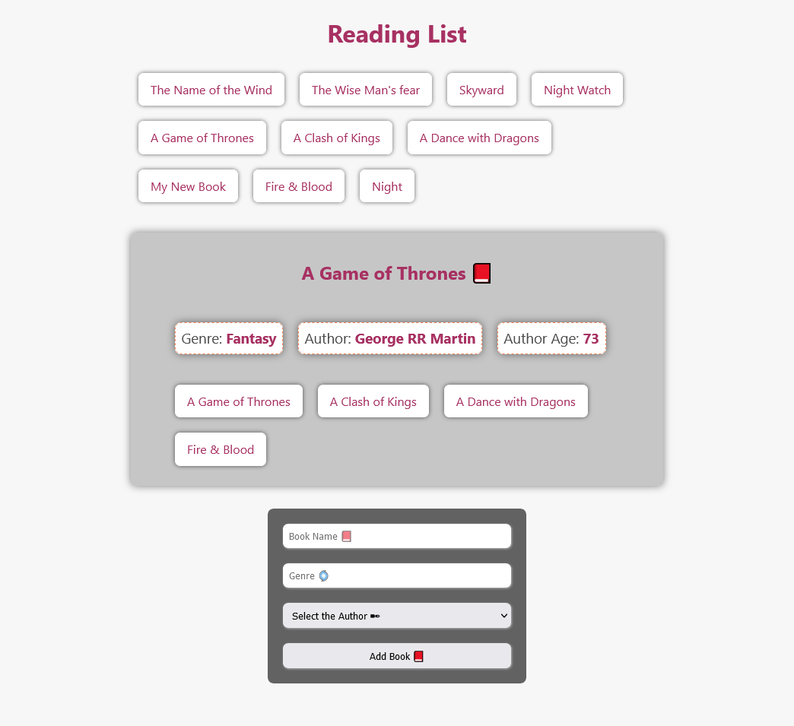

# GraphQL Basics

## Table of contents 📂

- [About GraphQL 💭](#about-graphql-📚)
  - [What is GraphQL ❓](#what-is-graphql)
  - [Why GraphQL ❓](#why-graphql)
  - [GraphQl 🆚 REST ](#graphql-vs-rest)
- [Project 📦](#project-📦)
- [Resources 🔗](#resources-🔗)

## About GraphQL 📚

### What is GraphQL

GraphQL is a query language for APIs and provides a completely understandable description of the data and gives the client exactly the data they want and nothing more with a single query.

### Why GraphQL

GraphQL makes it easy to specify the data you want to get from the APIs.

### GraphQl vs REST

The main difference between GraphQL and REST is that GraphQL is a specific query language. while REST is an architectural concept for network-based software.

In GraphQL you can have exactly what type of data you want (No _overfetching_ or _underfetching_). while in REST you can have a lot of data and you can specify the data you want to get leading to data _overfetching_ and _underfetching_ in some cases where you have to make another request to get the data you want.

 _Photo from [@NikkitaFTW](https://twitter.com/NikkitaFTW)_

## Project 📦

 **App Screenshot**

**I have created a Reading List App with _GraphQL_ for the server-side using _Express.js_ and _React_ for the client-side.**

### Server Side 👨‍💻

On the server side, we will specify the GraphQL Schema. And we are going to connect the server to a database using **_MongoDB_** and **_Mongoose_**.

#### **Schema**

The schema is the description of how our graph will look like, the type of data, and the relationship between the data.

<!-- #### **graphql/type**

The `graphql/type `module is responsible for defining GraphQL types and schema. You can import either from the `graphql/type` module or from the root graphql module. For example:

```js
import { GraphQLSchema } from 'graphql'; // ES6
var { GraphQLSchema } = require('graphql'); // CommonJS
```

Here is the list of all the `graphql/type` modules I used in this project:

-  -->

#### **Data Types 📝**

We have **books** and **authors** as the types of data and the code below shows how to create the type for the books and authors in the Schema file with GraphQL and set the fields we want for each type. 👇

```js
//Specifying what the book object type and what are the info about each book is.
const BookType = new GraphQLObjectType({
  name: 'Book',
  fields: () => ({
    id: { type: GraphQLID },
    name: { type: GraphQLString },
    genre: { type: GraphQLString },
    author: {
      type: AuthorType,
      resolve(parent, args) {
        //We are going to search for the author here from our database. (MongoDb)
        return Author.findById(parent.authorid)
      },
    },
  }),
})

//Specifying what the author object type and what are the info about each author is.
const AuthorType = new GraphQLObjectType({
  name: 'Author',
  fields: () => ({
    id: { type: GraphQLID },
    name: { type: GraphQLString },
    age: { type: GraphQLInt },
    books: {
      type: new GraphQLList(BookType),
      resolve(parent, args) {
        //We are going to search for the books here from our database. (MongoDb)
        return Book.find({ authorid: parent.id })
      },
    },
  }),
})
```

#### **Root Query 📚**

The root query is the starting point of the graph. And in it, we will describe how to retrieve data from GraphQL. Let's say that we want to get all the book's names and genres of books. In the root query, we will describe that by giving it a name and what it will resolve.

```js
{
  books {
    name
    genre
  }
}
```

_This is going to return all the book's names and genres._

**And here is how we can create the root query and create the books field 👇**

```js
const RootQuery = new GraphQLObjectType({
  name: 'RootQueryType',
  fields: {
    books: {
      type: new GraphQLList(BookType),
      return(parent, args) {
        //Get All the books from the database (MongoDB).
        return Book.find({})
      },
    },
  },
})
```

#### **Mutation 🧬**

To add books or authors to our database we need to create a mutation. And in the mutation, we will describe how to add books and authors to the database.

```js
const Mutation = new GraphQLObjectType({
  name: "Mutation",
  fields: {
    addAuthor: {
      type: AuthorType,
      args: {
        name: { type: new GraphQLNonNull(GraphQLString) },
        age: { type: new GraphQLNonNull(GraphQLInt) },
      },
      resolve(parent, args) {
        //author is the instance of the Author model from the data MongoDB
        let author = new Author({
          name: args.name,
          age: args.age,
        })
        //Save the author to the database (MongoDB).
        return author.save()
      },
      }
    }
  }
})
```

**When we are going to mutate some data we need to do it like this in GraphQL:**

```js
mutation {
  addAuthor(name: "John Doe", age: 35) {
    name
    age
  }
}
```

### Client-Side 👨‍💻

#### **Apollo Client**

In our react app we will use the **Apollo Client** to connect the client to the server. And to do that we need to add two things to our react app.js file.

1. We need to import the **Apollo Client** and use it to connect the client to the server by giving the `uri` to our graphql endpoint and by that we tell apollo that we are going to request the `/graphql` endpoint.

1. We need to import the **Apollo Provider** and use it to wrap our react app to inject any data coming from the server to our react app.

```js
import ApolloClient from 'apollo-boost'
import { ApolloProvider } from 'react-apollo'

const client = new ApolloClient({
  uri: 'http://localhost:5500/graphql',
})

function App() {
  return (
    <ApolloProvider client={client}>
      <div className='App'>
        <h1>Hello Apollo!</h1>
      </div>
    </ApolloProvider>
  )
}
```

#### **Queries 📚**

To create quires on the client-side we will use the `ApolloClient` library.

And take the `gql` from the `apollo-boost` library so that we can create some queries for example to get all the books and a query to add Books to the database. 👇

```js
import { gql } from 'apollo-boost'

const getBooksQuery = gql`
  {
    books {
      name
      id
    }
  }
`

const addBookMutation = gql`
  mutation ($name: String!, $genre: String!, $authorid: ID!) {
    addBook(name: $name, genre: $genre, authorid: $authorid) {
      name
      id
    }
  }
`
```

**To add the books to the database we need to pass the name, genre, and authorid to the mutation that's why we need to pass the variables to the mutation.**

#### **useQuery ⚓**

To get the data from the server using a query we will use the `useQuery` hook.

```js
import { Query } from 'react-apollo'
import { getBooksQuery } from '../queries/queries'

function BookList() {
  return (
    //The query getBooksQuery is the query we created above.
    <Query query={getBooksQuery}>
      {({ loading, error, data }) => {
        if (loading) return <p>Loading...</p>
        if (error) return <p>Error 😢</p>

        return (
          <ul className='book-list'>
            {data.books.map(({ name, id }) => {
              return <li key={id}>{name}</li>
            })}
          </ul>
        )
      }}
    </Query>
  )
}
```

#### **useMutation ⚓**

To add a book to our database we will use the `useMutation` hook.

When the user submits a form to add a book the function `onSubmit(data, addBook)` will have two arguments the data is the book information the user pass to add a book to the database. And addBook is the function that we get from the mutation. And if we want to pass those data to the mutation we need to pass the variables to the mutation.

**Here is how we can do it 👇**

```js
import { Mutation } from 'react-apollo'
import { addBookMutation } from '../queries/queries'
function addBook() {
  const onSubmit = (data, addBook) => {
    addBook({
      variables: {
        name: data.bookName,
        genre: data.genre,
        authorid: data.authorid,
      },
      refetchQueries: [{ query: getBooksQuery }],
    })
  }

  return (
    //This is the same addBookMutation that we created above.
    <Mutation mutation={addBookMutation}>
      {(addBook, { data }) => (
        <form onSubmit={handleSubmit((data) => onSubmit(data, addBook))}>
          <input
            placeholder='Book Name 📕'
            {...register('bookName', { required: true })}
          />
          <input
            placeholder='Genre 🌀'
            {...register('genre', { required: true })}
          />
          <select {...register('authorid')}>
            {' '}
            <option>Select the Author ✒</option>
            {options()}
          </select>
          <input type='submit' value='Add Book 📕' />
        </form>
      )}
    </Mutation>
  )
}
```

## Resources 🔗

### Tools ⚙

**For this project server I used these tools:**

- [Express](https://expressjs.com/)

- [GraphQL](https://graphql.org/)

**For this project client I used these tools:**

- [React](https://reactjs.org/) - I used [Vite](https://vitejs.dev/) to create the React App.

- [Apollo Client](https://www.apollographql.com/) - Apollo client is the bridge between the client and the server that is used to connect GraphQL to React to make queries and mutations.

**For database:**

- [MongoDB](https://www.mongodb.com/)
- [Mongoose](https://mongoosejs.com/)

### Other resources 🔗

- [GraphQL Tutorial by The Net Ninja](https://www.youtube.com/playlist?list=PL4cUxeGkcC9iK6Qhn-QLcXCXPQUov1U7f)
- [GraphQL VS REST APIs](https://graphcms.com/blog/graphql-vs-rest-apis)
- [GraphQL Type](https://graphql.org/graphql-js/type/#getnamedtype)
- [Sara Vieira Tweet](https://twitter.com/NikkitaFTW/status/1011928066816462848)
